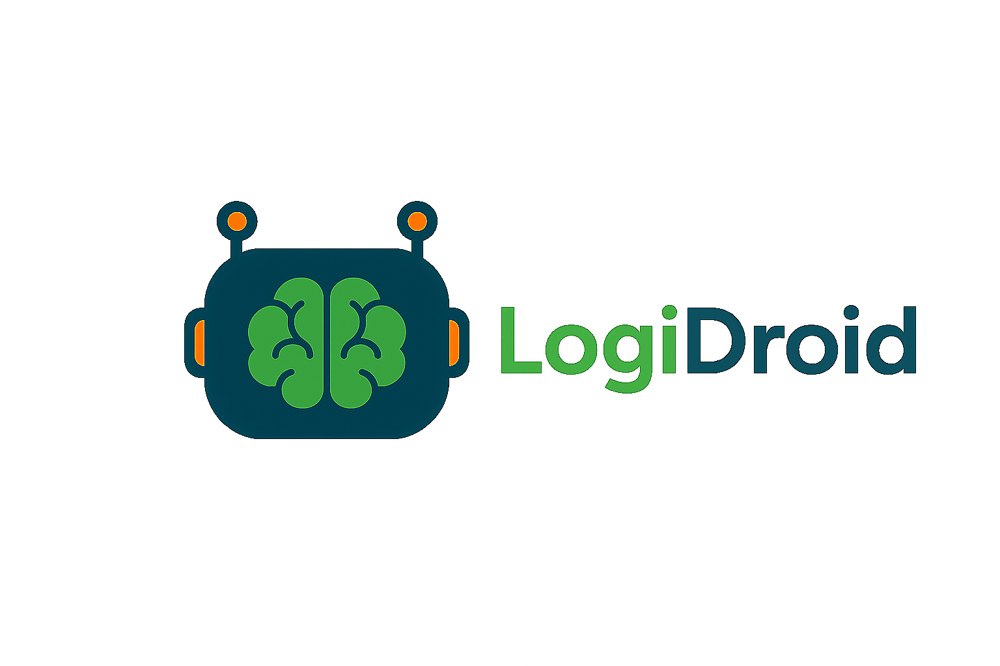
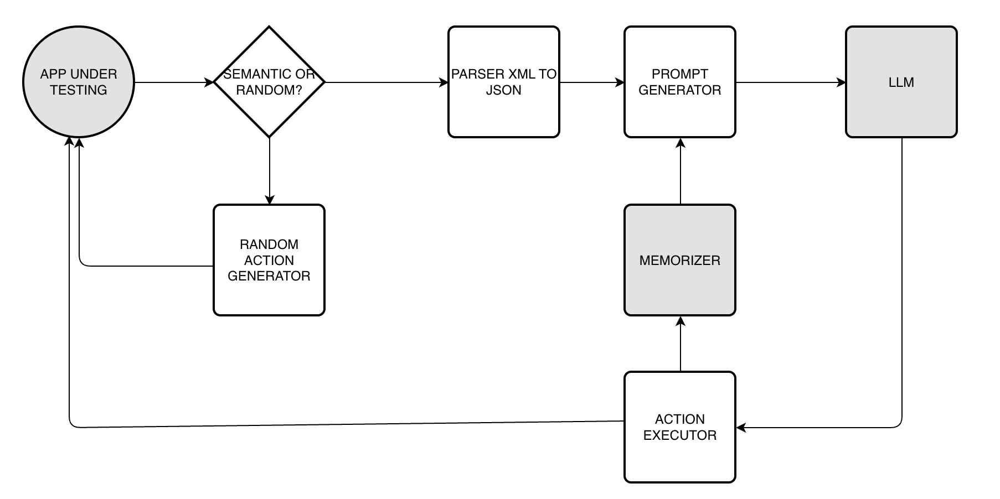

# 🧠 LogiDroid - Sistema di Automazione Android con LLM

<div align="center">
  
  <br><br>
  
  
  
  
  
</div>

LogiDroid automatizza le app Android combinando **cattura UI**, **analisi AI** e **esecuzione comandi** tramite ADB, utilizzando **Gemini 2.0 Flash** per decisioni intelligenti.

## 🔄 Workflow del Sistema

<div align="center">
  
</div>

### **� 1. Cattura UI**
- **Screenshot PNG** dell'app Android
- **XML UI hierarchy** tramite `uiautomator dump`
- **Conversione XML→JSON** per analisi strutturata

### **🧠 2. Analisi LLM**
- **Prompt generation** con elementi UI disponibili
- **Chiamata Gemini API** con istruzioni menu-based
- **Decisione AI** su prossima azione da eseguire

### **⚡ 3. Esecuzione**
- **Parsing comando** (CLICK/FILL)
- **Esecuzione ADB** (tap/input text)
- **Cattura nuova schermata** per iterazione successiva

## 🤖 Integrazione Gemini API

### **📡 Chiamata API:**
```python
# Costruzione prompt
prompt = load_instructions() + current_screen_elements + action_history

# Chiamata Gemini 2.0 Flash
response = requests.post(
    "https://generativelanguage.googleapis.com/v1beta/models/gemini-2.0-flash-exp:generateContent",
    headers={"x-goog-api-key": API_KEY},
    json={"contents": [{"parts": [{"text": prompt}]}]}
)

# Estrazione comando
command = extract_command(response.text)  # Es: "A" → "CLICK:Salva"
```

### **🎯 Sistema Menu-Based:**
```
📱 COMANDI DISPONIBILI:

A. CLICK:Salva
B. CLICK:Annulla  
C. FILL_CUSTOM:Nome
D. FILL_CUSTOM:Email

Risposta Gemini: "A"  →  Esegue: CLICK:Salva
```

## 📁 Struttura File

```
LogiDroid/
├── 🚀 Core System
│   ├── start_test.sh            # � Avvio sistema completo
│   ├── llm_api.py              # 🤖 Integrazione Gemini API
│   ├── prompt_generator.py     # 📝 Generazione prompt intelligenti
│   ├── xml_to_json.py          # 🔄 Conversione UI XML→JSON
│   └── adb_automator.sh        # ⚡ Automazione ADB (click/fill)
├── 📊 Data & Results  
│   └── test/
│       ├── screenshots/        # � Screenshot app (.png)
│       ├── xml/               # 🌐 UI hierarchy (.xml)
│       ├── json/              # 📋 Dati strutturati (.json)
│       └── prompts/           # 🧠 Action history e prompt
├── ⚙️ Configuration
│   ├── config.json            # 🔑 API Key Gemini
│   ├── complete_instructions.txt # 📜 Istruzioni per LLM
│   └── config_example.json    # 📋 Template configurazione
└── 📚 Documentation
    ├── README.md              # 📖 Questa documentazione
    └── docs/                  # 📚 Documentazione dettagliata
```

## 🚀 Quick Start

1. **Configura API Key:**
   ```bash
   cp config_example.json config.json
   # Inserisci la tua Gemini API key in config.json
   ```

2. **Avvia automazione:**
   ```bash
   ./start_test.sh
   ```

3. **Il sistema automaticamente:**

./cleanup_test.sh json        # Solo file JSON
./cleanup_test.sh xml         # Solo file XML
./cleanup_test.sh screenshots # Solo screenshot
./cleanup_test.sh prompts     # Solo cronologia
./cleanup_test.sh legacy      # File cartelle vecchie

# Ricreare struttura dopo pulizia completa
mkdir -p test/{json,xml,screenshots,prompts}
```

## 📚 Documentazione Tecnica

### Struttura JSON Elemento
```json
{
  "type": "button|input",
  "text": "Testo visibile",
  "content_desc": "Descrizione accessibilità", 
  "resource_id": "com.app.id:id/element",
  "bounds": {"x": 0, "y": 0, "width": 100, "height": 50},
  "clickable": true,
  "editable": false,
  "label": "Etichetta generata per menu"
}
```

### Sistema Menu-Based v3.0
- **Input automatici**: Sistema genera menu con opzioni A, B, C
- **Risposte lettere**: Gemini risponde solo con lettere (A, B, C)
- **Testo personalizzato**: Formato `F:Testo da scrivere`
- **Zero parsing errors**: Eliminati errori di interpretazione

### Gemini 2.0 Flash Integration
- **Model**: `gemini-2.0-flash-exp` (sperimentale, performance superiori)
- **Free Tier**: 15 richieste/minuto gratuito
- **Context**: 20 azioni precedenti per decisioni intelligenti
- **Latency**: Cloud-based, ~1-2 secondi per risposta

## 🔐 Sicurezza e Best Practices

### ⚠️ IMPORTANTE - Sicurezza API Key

### 🔒 **NON CONDIVIDERE MAI LA TUA API KEY**
- ✅ La tua API key è in `config.json` (escluso dal git)
- ❌ **NON** committare mai `config.json` nel repository
- ❌ **NON** condividere screenshot con la tua API key visibile
- ✅ Usa sempre `config_example.json` come template per altri

### 🛡️ **Verifiche di Sicurezza**
```bash
# Verifica che config.json sia nel .gitignore
git status  # config.json NON deve apparire

# Se config.json appare in git status:
git reset config.json  # Rimuovilo dal staging
echo "config.json" >> .gitignore  # Assicurati sia nel .gitignore
```
