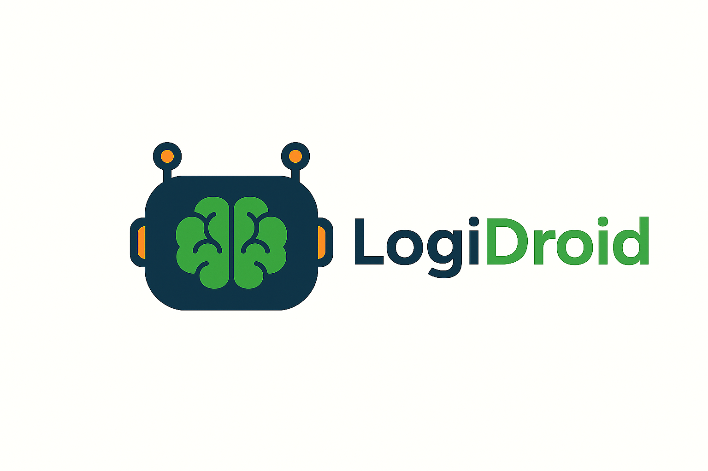

# 🧠 LogiDroid - Sistema Avanzato di Automazione Android con LLM

<div align="center">
  
  <br><br>
  
  
  
  
  
  
  
</div>

LogiDroid è un sistema all'avanguardia che combina cattura UI, analisi intelligente e automazione Android tramite ADB, con integrazione LLM locale per esplorazione autonoma e automazione guidata da intelligenza artificiale.

## 🌟 Caratteristiche Principali

- **🔍 Cattura Completa**: Screenshot PNG + struttura UI XML in formato JSON
- **🧠 Memoria Intelligente**: Sistema di cronologia azioni per mantenere il filo conduttore
- **🤖 LLM Locale**: Integrazione con Ollama per decisioni autonome
- **⚡ Automazione Precisa**: Click centrati e gestione dinamica delle interfacce
- **🎯 Esplorazione Autonoma**: L'LLM esplora le app mantenendo la logica delle azioni
- **� Targeting Avanzato**: Riconoscimento intelligente dei controlli Android

## 🆕 Novità v2.0

### ✨ Sistema di Memoria Avanzato
- **Cronologia Persistente**: Mantiene le ultime 10 azioni in `prompts/action_history.json`
- **Filo Conduttore**: L'LLM ricorda cosa ha fatto e continua logicamente
- **Contesto Dinamico**: Riconoscimento automatico del tipo di schermata

### 🎯 Targeting Migliorato
- **Click Centrati**: Calcolo automatico del centro degli elementi
- **Filtri Dimensionali**: Esclude elementi troppo piccoli (< 10px)
- **Coordinate Precise**: Sistema di bounds ottimizzato

### 🤖 LLM Ottimizzato
- **Ollama Integration**: LLM locale llama3.2:3b con parametri ottimizzati
- **Parsing Robusto**: Gestione intelligente delle risposte dell'LLM
- **Variabilità Controllata**: Temperature 0.7, repeat_penalty 1.2 per evitare loop

## 📁 Struttura del Progetto

```
LogiDroid/
├── 🚀 Core System (6 file essenziali)
│   ├── logidroid_complete.sh     # ⭐ Script principale unificato
│   ├── llm_local.py              # 🧠 LLM con sistema memoria avanzato  
│   ├── prompt_generator.py       # 📝 Generatore prompt con cronologia
│   ├── adb_automator.sh          # ⚡ Automazione ADB precisa
│   ├── xml_to_json.py            # 🔄 Convertitore interfacce
│   └── cleanup_test.sh           # 🧹 Utility pulizia test
├── 📁 Test Directory
│   └── test/                     # 🧪 Cartella test centralizzata
│       ├── json/                 # 📋 File JSON generati
│       ├── xml/                  # 📱 File XML interfacce
│       ├── screenshots/          # 📸 Screenshot PNG
│       └── prompts/              # 🧠 Sistema memoria LLM
├── 📁 Legacy (mantenute per compatibilità)
│   ├── prompts/                  # 🧠 Sistema memoria LLM legacy
│   ├── ui_captures/              # 📱 Catture interfacce XML legacy
│   └── screenshots/              # 📸 Screenshot PNG legacy
└── 📖 Documentation
    ├── icona.png                 # 🎨 Logo del progetto
    ├── README.md                 # 📚 Questa documentazione
    └── .gitignore               # 🚫 File ignorati da Git
```

## 🚀 Quick Start

### 1. Prerequisiti

#### Software Richiesto
```bash
# Android Debug Bridge
brew install android-platform-tools  # macOS
# oppure installa Android SDK

# Python 3.9+
python3 --version

# Ollama per LLM locale
brew install ollama
ollama pull llama3.2:3b
```

#### Setup Dispositivo Android
```bash
# Abilita Opzioni Sviluppatore e Debug USB
adb devices  # Verifica connessione

# Autorizza il computer quando richiesto dal dispositivo
```

### 2. Utilizzo Immediato

#### 🎯 Esplorazione Autonoma (Consigliato)
```bash
### 2. Utilizzo Immediato

#### 🎯 Esplorazione Autonoma (Un Solo Comando!)
```bash
# Naviga all'app che vuoi esplorare sul dispositivo
# Avvia l'esplorazione autonoma
./logidroid_complete.sh

# ✨ Il sistema fa tutto automaticamente:
# 📸 Cattura screenshot + interfaccia XML
# 🔄 Converte in JSON strutturato  
# 🧠 L'LLM analizza e decide l'azione
# ⚡ Esegue l'azione via ADB
# 💾 Memorizza per mantenere il filo conduttore
```

#### � Componenti Individuali (Uso Avanzato)
```bash
# Cattura e conversione
python3 xml_to_json.py test/xml/input.xml test/json/output.json

# Generazione prompt con memoria
python3 prompt_generator.py test/json/result.json

# LLM locale con Ollama
python3 llm_local.py test/json/result.json

# Automazione ADB diretta
./adb_automator.sh test/json/result.json click_button "Nome Bottone"
./adb_automator.sh test/json/result.json fill_field "Nome Campo" "Valore"
```

## 📊 Output del Sistema

### File Generati (Cartella test/)
```
📸 test/screenshots/screen_TIMESTAMP.png    # Screenshot PNG dell'interfaccia
📱 test/xml/current_TIMESTAMP.xml           # Struttura UI in formato XML
📋 test/json/result_current_TIMESTAMP.json  # Dati strutturati per l'LLM
🧠 test/prompts/action_history.json         # Cronologia azioni (max 10)
📝 test/prompts/last_action.txt             # Ultima azione eseguita
```

### Gestione File di Test
```bash
# Pulizia rapida di tutti i file di test
rm -rf test/

# Pulizia selettiva
rm -rf test/json/*          # Solo file JSON
rm -rf test/xml/*           # Solo file XML  
rm -rf test/screenshots/*   # Solo screenshot
rm -rf test/prompts/*       # Solo cronologia azioni
```

### Esempio JSON Generato
```json
{
  "source_file": "current_1234567890.xml",
  "timestamp": "2025-08-17T19:30:00.000000",
  "total_buttons": 15,
  "total_inputs": 3,
  "elements": [
    {
      "type": "button",
      "text": "Salva",
      "content_desc": "Salva contatto",
      "bounds": {"x": 540, "y": 2020, "width": 325, "height": 147},
      "clickable": true,
      "label": "Salva"
    },
    {
      "type": "input",
      "text": "",
      "hint": "Inserisci nome",
      "bounds": {"x": 159, "y": 491, "width": 800, "height": 92},
      "editable": true,
      "label": "Nome (VUOTO) [pos:159,491]"
    }
  ]
}
```

## 🧠 Sistema di Memoria Avanzato

### Cronologia delle Azioni
```json
[
  {
    "timestamp": "2025-08-17T19:30:00.000000",
    "action": "CLICK:Aggiungi",
    "screen": "Schermata lista contatti"
  },
  {
    "timestamp": "2025-08-17T19:30:15.000000", 
    "action": "FILL:Nome:Mario Rossi",
    "screen": "Schermata di creazione contatto"
  },
  {
    "timestamp": "2025-08-17T19:30:30.000000",
    "action": "CLICK:Salva", 
    "screen": "Schermata di creazione contatto"
  }
]
```

### Prompt Generato con Memoria
```
🤖 ESPLORAZIONE AUTONOMA ANDROID - MANTIENI IL FILO CONDUTTORE

📱 AZIONI PRECEDENTI (mantieni la logica!):
1. CLICK:Aggiungi → Schermata di creazione contatto
2. FILL:Nome:Mario Rossi → Schermata di creazione contatto

📍 SCHERMATA ATTUALE: Schermata di creazione contatto

🎯 OBIETTIVO: Esplora l'app in modo logico e coerente
• Ricorda le azioni precedenti e continua il percorso
• Se hai appena compilato campi, considera di salvare
• Se sei in una lista, prova a aprire elementi
• Evita di ripetere sempre le stesse azioni
```

## 🔧 API e Comandi

### 🎯 Sistema Semplificato (v2.0)
```bash
# Setup una volta sola
brew install ollama android-platform-tools
ollama pull llama3.2:3b

# Uso quotidiano - UN SOLO COMANDO!
./logidroid_complete.sh     # ⭐ Fa tutto automaticamente
```

### 🧹 Gestione File Test
```bash
./cleanup_test.sh all      # Rimuove tutti i file test
./cleanup_test.sh json     # Solo file JSON
./cleanup_test.sh xml      # Solo file XML
./cleanup_test.sh screenshots # Solo screenshot
```

### 🔧 Componenti Individuali (Opzionale)
```bash
# Conversione manuale
python3 xml_to_json.py test/xml/input.xml test/json/output.json

# Generazione prompt
python3 prompt_generator.py test/json/result.json

# LLM locale
python3 llm_local.py test/json/result.json

# Automazione ADB
./adb_automator.sh test/json/result.json click_button "Nome"
./adb_automator.sh test/json/result.json fill_field "Campo" "Valore"
```

## ⚙️ Configurazione LLM

### Parametri Ollama Ottimizzati
```json
{
  "model": "llama3.2:3b",
  "temperature": 0.7,        // Variabilità per evitare loop
  "repeat_penalty": 1.2,     // Penalità ripetizioni
  "top_p": 0.9,             // Diversità token
  "num_predict": 50         // Lunghezza risposta
}
```

### Formato Risposte LLM
```
CLICK:Nome_Bottone          # Clicca un bottone
FILL:Nome_Campo:Valore      # Compila un campo
```

## 🔍 Risoluzione Problemi

### LLM Non Risponde
```bash
# Verifica Ollama
curl http://localhost:11434/api/tags
brew services restart ollama
```

### Dispositivo Non Connesso
```bash
# Verifica connessione ADB
adb devices
adb kill-server && adb start-server
```

### Click Non Precisi
Il sistema ora usa **click centrati** automaticamente:
- Calcola centro elemento: `center_x = x + width/2`
- Filtra elementi troppo piccoli: `width > 10 && height > 10`

### Memoria Non Funziona
```bash
# Verifica cartelle
ls -la prompts/
# Deve essere scrivibile per action_history.json e last_action.txt
```

## 🎯 Esempi d'Uso

### Esplorazione App Contatti
```bash
# 1. Apri app Contatti
# 2. Esegui LogiDroid
./logidroid_complete.sh

# Output esempio:
# 📱 AZIONI PRECEDENTI:
# 1. CLICK:Aggiungi → Schermata di creazione contatto
# 2. FILL:Nome:Mario Rossi → Schermata di creazione contatto
# 3. CLICK:Salva → Lista contatti
```

### Debug Interfaccia
```bash
# Cattura interfaccia problematica
python3 xml_to_json.py test/xml/problem.xml test/json/debug.json
python3 prompt_generator.py test/json/debug.json

# Analizza elementi disponibili
./adb_automator.sh test/json/debug.json list_elements
```

### Gestione File di Test
```bash
# Pulizia completa
./cleanup_test.sh all

# Pulizia selettiva
./cleanup_test.sh json        # Solo file JSON
./cleanup_test.sh xml         # Solo file XML
./cleanup_test.sh screenshots # Solo screenshot
./cleanup_test.sh prompts     # Solo cronologia
./cleanup_test.sh legacy      # File cartelle vecchie

# Ricreare struttura dopo pulizia completa
mkdir -p test/{json,xml,screenshots,prompts}
```

## � Documentazione Tecnica

### Struttura JSON Elemento
```json
{
  "type": "button|input",
  "text": "Testo visibile",
  "content_desc": "Descrizione accessibilità", 
  "resource_id": "com.app.id:id/element",
  "bounds": {"x": 0, "y": 0, "width": 100, "height": 50},
  "clickable": true,
  "editable": false,
  "label": "Etichetta generata intelligentemente"
}
```

### Sistema di Etichettatura
- **Campi testo**: `Nome (VUOTO) [pos:159,491]` o `Nome (COMPILATO: 'Mario') [pos:159,491]`
- **Bottoni**: Usa `text`, `content_desc`, o `resource_id` in ordine di preferenza
- **Coordinate**: Sempre incluse per debugging

## 🤝 Contribuire

### Setup Sviluppo
```bash
git clone https://github.com/MisterCioffi/LogiDroid
cd LogiDroid
chmod +x *.sh
```

### Test Suite
```bash
# Test conversione XML
python3 xml_to_json.py ui_captures/1.xml test.json

# Test generazione prompt
python3 prompt_generator.py test.json

# Test automazione
./adb_automator.sh test.json list_elements
```

## 📄 Licenza

MIT License - Vedi file LICENSE per dettagli.

## � Links Utili

- [Android Debug Bridge](https://developer.android.com/studio/command-line/adb)
- [Ollama](https://ollama.ai/)
- [UIAutomator](https://developer.android.com/training/testing/ui-automator)

---

**LogiDroid v2.0** - Sistema di Automazione Android con Intelligenza Artificiale e Memoria 🤖📱
# 2. Genera scenari test
python3 prompt_generator.py test.json test
# 3. Usa LLM per pianificare test completi
```

## 🚨 Troubleshooting

### Dispositivo Non Connesso
```bash
# Verifica connessione
adb devices

# Se nessun dispositivo:
# 1. Abilita "Opzioni sviluppatore" su Android
# 2. Abilita "Debug USB"
# 3. Autorizza computer quando richiesto
```

### Errori di Permessi
```bash
# Rendi eseguibili gli script
chmod +x *.sh
chmod +x *.py
```

### Cattura UI Fallisce
```bash
# Verifica che UIAutomator sia disponibile
adb shell uiautomator dump --help

# Se non disponibile, aggiorna Android SDK
```

## 🔬 Architettura Tecnica

### 1. Cattura UI (UIAutomator)
- Dump XML della struttura UI corrente
- Estrazione elementi clickable ed editabili
- Coordinate precise per automazione

### 2. Processamento Intelligente
- Parser XML ottimizzato (ElementTree)
- Analisi contestuale per etichette automatiche
- Filtro elementi rilevanti (bottoni, campi input)

### 3. Generazione Prompt
- Template strutturati per diversi use case
- Context injection basato su package app
- Formato output standardizzato JSON

### 4. Automazione ADB
- Comandi touch, input testo, navigazione
- Error handling e feedback utente
- Timing intelligente per animazioni

## 📈 Ottimizzazioni

- **Codice ridotto del 73%**: Da 670 a 183 righe nel parser principale
- **Parser efficiente**: ElementTree con XPath ottimizzati
- **Cache intelligente**: Riutilizzo dati JSON tra sessioni
- **Error resilience**: Handling robusto errori ADB e parsing

## 🤝 Contribuire

1. Fork del repository
2. Crea feature branch
3. Commit con messaggi descrittivi
4. Push e crea Pull Request

## 📄 Licenza

MIT License - Vedi file LICENSE per dettagli

## 🔗 Collegamenti

- [Android Debug Bridge](https://developer.android.com/studio/command-line/adb)
- [UIAutomator](https://developer.android.com/training/testing/ui-automator)
- [Android Accessibility](https://developer.android.com/guide/topics/ui/accessibility)

---

**🎯 LogiDroid**: Dove l'automazione Android incontra l'intelligenza artificiale 🚀

# LogiDroid
LogiDroid: tool di testing per applicazioni Android basato sul prompt engineering, che guida le interazioni con l’app tramite intelligenza artificiale.
