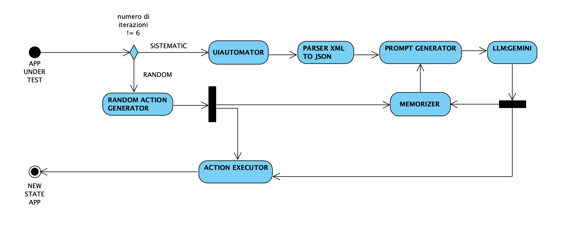

# 🧠 LogiDroid - Sistema di Automazione Android con LLM

<div align="center">
  
  <br><br>
  
  
  
  
  
</div>

LogiDroid automatizza le app Android combinando **cattura UI**, **analisi AI** e **esecuzione comandi** tramite ADB, utilizzando **Gemini 2.0 Flash** per decisioni intelligenti.

## 🔄 Workflow del Sistema

<div align="center">
  
</div>

Il flusso operativo di LogiDroid si articola in più fasi sequenziali che possono essere distinte in due percorsi principali: un **flusso sistematico**, guidato dal modello LLM, e un **flusso randomico**, pensato per aumentare la varietà degli stati esplorati.

### **🔄 Flusso sistematico**
1. Acquisizione della struttura della GUI tramite `UIAutomator`, che produce un file XML;
2. Conversione della struttura in formato JSON tramite il modulo `LogiDroidConverter`;
3. Generazione del prompt tramite il modulo `LogiDroidPrompter` e invio all'LLM;
4. Selezione dell'azione più opportuna da parte del modello;
5. Esecuzione dell'azione sull'applicazione tramite il modulo `ActionExecutor`, che traduce la risposta dell'LLM in un comando `adb`;
6. Avvio di un nuovo ciclo sistematico, a meno che non sia stata raggiunta la sesta iterazione.

### **🎲 Flusso randomico**
Al termine di ogni ciclo di 6 iterazioni con l'LLM, LogiDroid introduce un flusso randomico per garantire diversificazione:
1. Selezione di un'azione casuale da parte di `LogiDroidRandomizer`;
2. Memorizzazione dell'azione eseguita tramite il modulo `Memorizer`;
3. Esecuzione dell'azione tramite il modulo `ActionExecutor`;
4. Transizione dell'applicazione verso un nuovo stato, da cui riprende il testing sistematico.

## 📁 Struttura Progetto

```
LogiDroid/
├── 🚀 Core System
│   ├── start_test.sh            # � Avvio sistema completo
│   ├── llm_api.py              # 🤖 Integrazione Gemini API
│   ├── prompt_generator.py     # 📝 Generazione prompt intelligenti
│   ├── xml_to_json.py          # 🔄 Conversione UI XML→JSON
│   └── adb_automator.sh        # ⚡ Automazione ADB (click/fill)
├── 📊 Data & Results  
│   └── test/
│       ├── screenshots/        # � Screenshot app (.png)
│       ├── xml/               # 🌐 UI hierarchy (.xml)
│       ├── json/              # 📋 Dati strutturati (.json)
│       └── prompts/           # 🧠 Action history e prompt
├── ⚙️ Configuration
    ├── config.json            # 🔑 API Key Gemini
    └── config_example.json    # 📋 Template configurazione

```

## 🚀 Come Iniziare i Test

### 📋 Prerequisiti
- **Android 10** (testato e verificato)
- **Python 3.9+** installato
- **ADB** (Android Debug Bridge) configurato
- **Gemini API Key** valida

### 🔧 Setup Iniziale

#### 0. **Installazione ADB (se non presente)**

**📦 macOS:**
```bash
# Con Homebrew (consigliato)
brew install android-platform-tools

# Verifica installazione
adb version
```

**🐧 Linux (Ubuntu/Debian):**
```bash
# Installazione via apt
sudo apt update
sudo apt install adb

# Verifica installazione
adb version
```

**🪟 Windows:**
```bash
# Scarica Android SDK Platform Tools da:
# https://developer.android.com/studio/releases/platform-tools
# Estrai e aggiungi la cartella al PATH di sistema
```

#### 1. **Configurazione API Key**
```bash
# Copia il template di configurazione
cp config_example.json config.json

# Modifica config.json e inserisci la tua Gemini API Key
nano config.json
```

#### 2. **Preparazione Dispositivo Android**

**📱 Collegamento USB:**
- Collega il telefono Android tramite **cavo USB**
- Assicurati che il telefono sia riconosciuto dal computer

**⚙️ Requisiti Smartphone:**
1. Vai in **Impostazioni** > **Info telefono**
2. Tocca **Numero build** 7 volte per abilitare le **Opzioni sviluppatore**
3. Torna nelle **Impostazioni** > **Opzioni sviluppatore**
4. Abilita:
   - ✅ **Debug USB**
   - ✅ **Rimani attivo** (opzionale ma consigliato)

**🔒 Disabilitazione Servizi di Accessibilità:**
- Vai in **Impostazioni** > **Accessibilità**
- **Disabilita** tutti i servizi di accessibilità esterni (es. TalkBack, assistenti vocali)
- Questo previene interferenze durante l'automazione

**📦 Preparazione App da Testare:**
- Apri l'app che vuoi testare
- Assicurati che sia nella schermata principale/home dell'app

#### 3. **Verifica Connessione**
```bash
# Verifica che il dispositivo sia connesso
adb devices

# Dovresti vedere qualcosa come:
# List of devices attached
# ABC123DEF456    device
```

### 🏁 Avvio Test

Una volta completata la configurazione:

```bash
# Avvia il test automatico
./auto_test.sh
```

**Il sistema automaticamente:**
- 📸 Cattura la schermata corrente
- 🌐 Estrae la struttura UI tramite UIAutomator
- 📋 Converte i dati in formato JSON
- 🧠 Genera prompt per Gemini API
- ⚡ Esegue l'azione suggerita dall'AI
- 🔄 Ripete il ciclo per 50 iterazioni (o fino a interruzione)

### 📊 Monitoraggio Test

Durante l'esecuzione vedrai:
- **Activity Coverage** in tempo reale
- **Screenshot** salvati in `test/screenshots/`
- **Dati UI** salvati in `test/xml/` e `test/json/`
- **Cronologia azioni** in `test/prompts/`

### 🧹 Gestione File di Test

Dopo i test, la cartella `test/` può accumulare molti file. Usa `cleanup_test.sh` per gestirli:

```bash
# Pulizia selettiva per tipo di file
./cleanup_test.sh json        # Rimuove solo file JSON
./cleanup_test.sh xml         # Rimuove solo file XML  
./cleanup_test.sh screenshots # Rimuove solo screenshot
./cleanup_test.sh prompts     # Rimuove solo cronologia azioni
./cleanup_test.sh coverage    # Rimuove solo dati coverage

# Pulizia completa
./cleanup_test.sh all         # Rimuove tutti i file di test

# Pulizia cartelle legacy (vecchie sessioni)
./cleanup_test.sh legacy      # Rimuove cartelle test precedenti
```

**📁 Struttura mantenuta:**
Dopo la pulizia, le cartelle vengono ricreate automaticamente:
```bash
# Struttura che rimane sempre disponibile
test/
├── screenshots/    # Vuota ma pronta
├── xml/           # Vuota ma pronta  
├── json/          # Vuota ma pronta
├── prompts/       # Vuota ma pronta
└── coverage/      # Vuota ma pronta
```

**💡 Consigli d'uso:**
- Pulisci i file prima di test importanti per evitare confusione
- Mantieni solo i screenshot dei risultati interessanti
- Usa `./cleanup_test.sh prompts` per resettare la memoria dell'AI

### ⚠️ Note Importanti

- **Testato su Android 10** - Compatibilità con altre versioni non garantita
- **Connessione USB richiesta** - Non funziona via WiFi/wireless
- **Un'app alla volta** - Assicurati che solo l'app target sia aperta
- **Supervisione consigliata** - Monitora i primi test per verificare il comportamento

